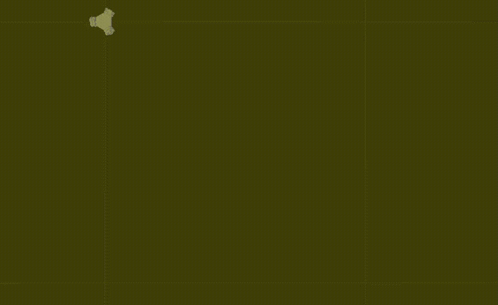

# omnirosbot
ROS package of three wheeled omnidirectional robot based on (https://github.com/GuiRitter/OpenBase) model.

## Environment
- Ubuntu 20.04
- ROS Noetic Ninjemys

## How to run
1. To clone this repository: 
	`cd ~/catkin_ws/src && git clone ...`
2. To build *omnirosbot* package:
	`cd .. && catkin_make`
3. To source paths for roslaunch:
	`source devel/setup.bash`
4. To launch gazebo with model:
	`roslaunch omnirosbot gazebo_view.launch`
5. In new terminal window, in omnirosbot's src folder (`~/catkin_ws/src/omnirosbot/src`):
	`python3 controller.py`

## It work

